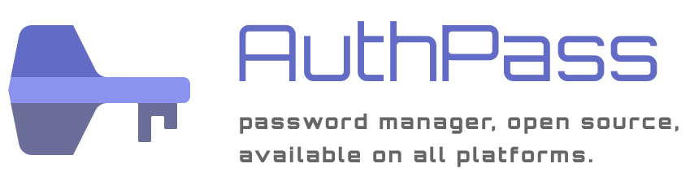
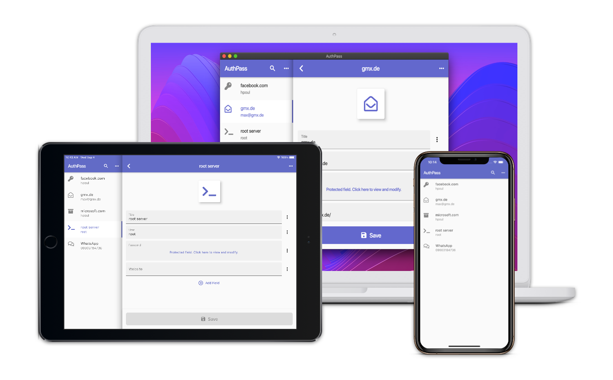

# AuthPass.app - Open Source Password Manager for mobile and desktop

AuthPass - Password Manager based on Flutter for all platforms. Keepass 2.x (kdbx 3.x) compatible.

* Mac Desktop: [Mac App Store](https://apps.apple.com/app/authpass-password-manager/id1478552452?ls=1&mt=12) or [check the releases](https://github.com/authpass/authpass/releases)
* Android: [Google Play Store](https://play.google.com/store/apps/details?id=design.codeux.authpass)
* iOS: Coming soon ;-)

## Roadmap/TODOs

see also https://github.com/authpass/authpass/issues

* [x] Read/Decrypt kdbx 3.x using password
* [x] download of kdbx files through url
* [x] Parse decrypted XML/handle protected values
* [x] Flutter scaffold for mobile (ios/android)
* [ ] Platforms
  * [x] iOS
  * [x] Android
  * [x] Mac OS
  * [ ] Windows
  * [ ] Linux
* [ ] Decrypt with keyfile
* [x] List of password entries
* [x] 👆️ Search through entries
* [x] 👆️ Entry details
* [x] 👆️ mobile: copy usernames, passwords
* [x] mobile: integrate with biometrics (fingerprint)
* [ ] mac: Auto-Type
* [ ] 👆️ Auto-lock after x minutes of inactivity.
* [ ] Integration of basic analytics and error reporting
* [x] Editing existing entries
* [x] Saving of changes into kdbx file.
* [x] Creating of new kdbx files.
* [ ] Syncing of kdbx files via custom cloud service and QR codes.
* [x] Syncing with cloud services like dropbox or google drive?
* [x] 👆️ CI pipeline/continous builds, releases
* [ ] kdbx 4 support (missing argon2) compatibility
* [ ] Android: Auto Fill
* [ ] iOS: Auto Fill
