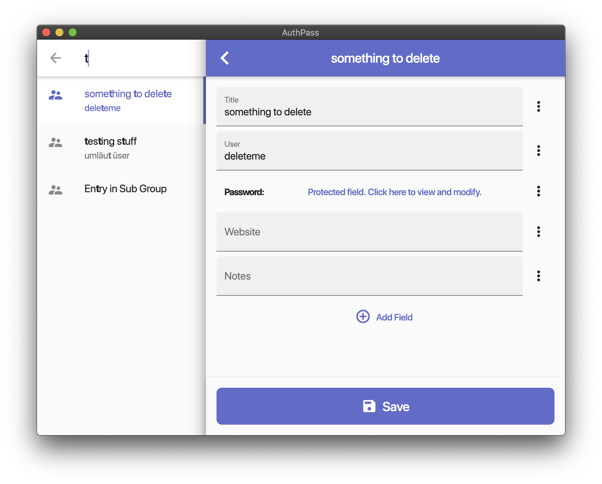

# AuthPass.app - Open Source Password Manager for mobile and desktop

AuthPass - Password Manager based on Flutter for all platforms. Keepass 2.x (kdbx 3.x) compatible.

## Roadmap/TODOs

see also https://github.com/authpass/authpass/issues

* [x] Read/Decrypt kdbx 3.x using password
* [x] download of kdbx files through url
* [ ] Decrypt with keyfile
* [x] Parse decrypted XML/handle protected values
* [x] Flutter scaffold for mobile (ios/android)
* [ ] Flutter scaffold for desktop (mac/win/linux)
* [x] List of password entries
* [x] 👆️ Search through entries
* [x] 👆️ Entry details
* [x] 👆️ mobile: copy usernames, passwords
* [ ] mobile: integrate with biometrics (fingerprint)
* [ ] mac: Auto-Type
* [ ] 👆️ Auto-lock after x minutes of inactivity.
* [ ] Integration of basic analytics and error reporting
* [x] Editing existing entries
* [x] Saving of changes into kdbx file.
* [x] Creating of new kdbx files.
* [ ] Syncing of kdbx files via custom cloud service and QR codes.
* [ ] Syncing with cloud services like dropbox or google drive?
* [ ] 👆️ CI pipeline/continous builds, releases
* [ ] kdbx 4 support (missing argon2) compatibility
